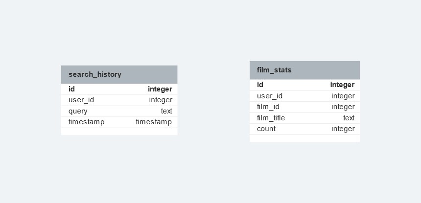

# Краткое описание

## Поддерживаемые команды

- `/start` - начать общение с ботом
- `/help` - список доступных команд
- `/history` - история последних 5 запросов
- `/stats` - 5 самых популярных фильмов

## Используемые бибилотеки

Бот написан с использованием библиотек aiogram, asyncio, aiosqlite.

## Используемое API

Для поиска фильмов используется https://kinopoiskapiunofficial.tech/

## Структура БД

## Окружение

Бот задеплоен в облако DigitalOcean. 
Инстанс находится во Франкфурт-на-Майне, так что возможны чуть большее пинги.

Креды берутся из конфигурационного файла `config.yaml`